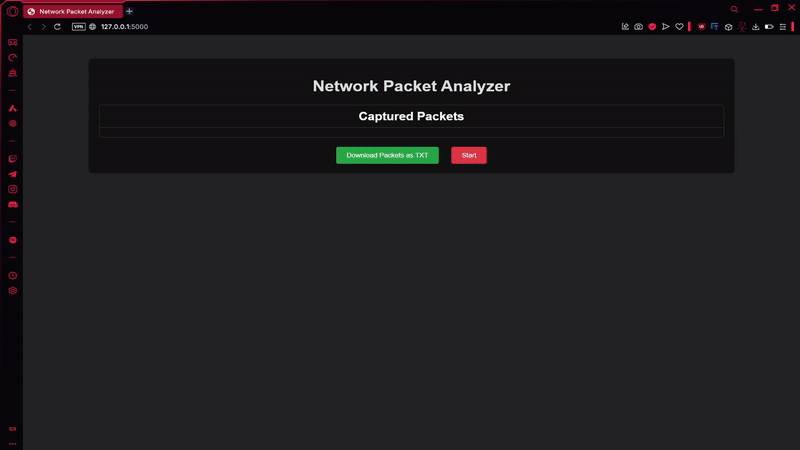

# PRODIGY_CS_05
# Network Packet Analyzer 🚀

A real-time network packet capture and analysis tool built with Python (Flask), Scapy, and Npcap. This project enables you to monitor and analyze incoming and outgoing network traffic, providing detailed insights into IP, TCP, and UDP headers with a simple and intuitive web interface.

## Features 🌟
- **Real-time packet capture**: Monitors live network traffic and displays it dynamically.
- **Detailed packet analysis**: Displays detailed information such as:
  - Source and Destination IP addresses 🌐
  - Protocol (IP, TCP, UDP) 🔄
  - TTL (Time To Live) ⏳
  - IP version, IP length 📏
  - Source and Destination ports ⚓️
  - Payload data 📑
  - TCP flags, sequence, and acknowledgment numbers (for TCP packets) ⚡️
- **Web interface**: A clean, user-friendly interface to interact with the captured data.
- **Start/Stop capture**: Toggle between starting and stopping the capture process.
- **Download captured packets**: Export captured data as a `.txt` file for offline analysis.

## Tech Stack 💻
- **Python (Flask)**: Web framework to serve the application.
- **Scapy**: For capturing and analyzing network packets.
- **Npcap**: Network packet capture library for Windows (required for Scapy to function).

## Installation 🛠️

### Prerequisites
- Python 3.x
- Npcap installed on your system (Windows only)

### Step 1: Install Dependencies
1. Clone the repository:
    ```bash
    git clone 
    cd 
    ```

2. Install the required Python packages:
    ```bash
    pip install -r requirements.txt
    ```

3. Install Npcap (if not installed already). You can download the latest version from [Npcap official website](https://nmap.org/npcap/).

### Step 2: Run the Application
1. Start the Flask web server:
    ```bash
    python app.py
    ```

2. Open a web browser and navigate to:
    ```
    http://127.0.0.1:5000
    ```

3. The app will be ready to start capturing network packets.

## Usage 📊

1. **Start Capture**:
   - Click the **Start** button to begin capturing packets.
   - The tool will start displaying live network packet data in real-time.

2. **Stop Capture**:
   - Once capturing is in progress, the button will change to **Stop**.
   - Click **Stop** to halt the capture and stop updating the packet list.

3. **Download Packets**:
   - Click the **Download Packets as TXT** button to download the captured packet data in `.txt` format. This will allow you to save and review the packet details offline.
---

## Example Screenshot 📸
  
*Image of the user interface showing captured packets.*

## Troubleshooting ⚠️

- **Npcap not installed**: Make sure Npcap is installed on your system (required for Scapy to capture packets).
- **Permission Issues**: Ensure that you run the application with the necessary privileges to access network interfaces (administrator/root permissions may be required).
- **Firewall issues**: Some firewalls may block packet capture. Ensure your firewall is configured to allow the app to capture packets.

## Contributing 🤝

We welcome contributions to improve the project! If you'd like to contribute, please fork the repository and submit a pull request.
---

Enjoy capturing and analyzing network traffic with your new **Network Packet Analyzer**! 🔍🌐
